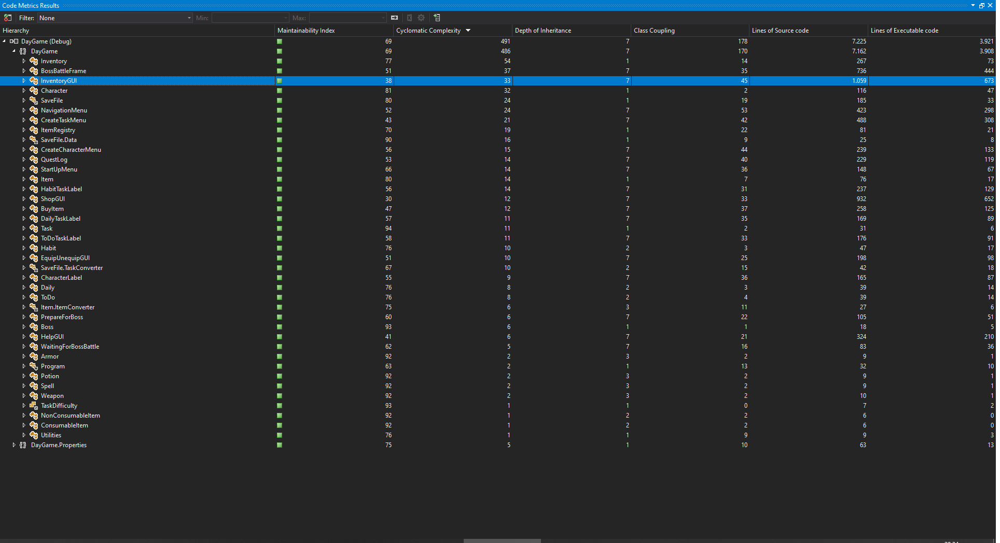

# DayGame - Code Metrics

DayGame's code metrics were calculated with two tools: [Microsoft Visual Studio 2019][vs-metrics] and with [SourceMonitor].

> __Note:__ Contrary to the deliverable's statement, a cohesion metric was unfortunately not included because it was not in free tools. Such metric exists on [NDepend] but was not used because it is commercial.

## Visual Studio's metrics

A full report of Visual Studio's metrics could not be attached to this document due to technical problems. Instead a brief overview is given below:

## SourceMonitor's metrics

An overview of SourceMonitor's metrics are attached in a PDF file. For more details, the complete SourceMonitor report is also attached in an `.smproj` file that can be opened with SourceMonitor.

## Thoughts on the metrics

* SourceMonitor correctly indicated that the codebase is poorly commented. More code comments, especially documentation for core non-GUI classes will make the codebase easier to understand in the long term and more appealing to potential open-source contributors.
* SourceMonitor gives methods like `InventoryGUI.Equip` a large cyclomatic complexity, suggesting a code smell, but actually [these values are still considered acceptable][csharpcorner].
* SourceMonitor's _Max Depth_ metric is also misleading: the class it considers the deepest (`Item.cs`) contains no more than one level of nesting _in a method_ (probably it considers the namespace and nested class declarations as depth too).
* Visual Studio's report contains a composite metric called [_Maintainability Index_][maintainability-index]. Values above 20 are considered good; DayGame's index is 69. Some methods in GUI forms named `InitializeComponent` have a very low score (sometimes single-digit) but there should be little concern for them since they contain auto-generated code for Windows Forms.
* The first 14 classes with the most lines of executable code are GUI classes. Again, this is blamed to Windows Forms. Something similar happens with the _Class Coupling_ metric.
* GUI classes have a _Depth of Inheritance_ of 7, because they inherit [Windows Forms' `Form` class][winforms-form] which has a _Depth of Inheritance_ of 6. Non-GUI classes don't have a _Depth of Inheritance_ bigger than 3.

[NDepend]: https://www.ndepend.com/
[vs-metrics]: https://docs.microsoft.com/en-us/visualstudio/code-quality/how-to-generate-code-metrics-data?view=vs-2019#calculate-code-metrics-menu-command
[SourceMonitor]: https://www.campwoodsw.com/sourcemonitor.html
[csharpcorner]: https://www.c-sharpcorner.com/article/code-metrics-cyclomatic-complexity/
[maintainability-index]: https://docs.microsoft.com/en-gb/archive/blogs/codeanalysis/maintainability-index-range-and-meaning
[winforms-form]: https://docs.microsoft.com/en-us/dotnet/api/system.windows.forms.form?view=netcore-3.1
